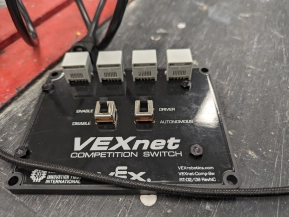

# Wednesday, 1st of May 2024
---
- **Aim:** to brain-storm ideas for a robot to compete in the recently released *VEX V5RC High Stakes 2024-2025* game
- **Strategy:** It was planned in this robotics session for the robot to take possession of a mobile goal to ease the process of scoring
- We refurbised the base of our previous robot *(for the VEX V5RC Over Under 2023-2024 game)* as the base for our new robot *(through removing old components such as the arm)*
- 
- Research had also been conducted for different means of scoring.
- Additionally, the thought of elevation of the robot was also considered though quickly discarded due to impracticalities
- ## Giant Code Bugfix
  - Meanwhile, due to the newly arrived field controller, Ethan was able to debug and test his code to fix the **LARGEST BUG** that prevented our robot from even moving last year
  - The bug was extremely hard to debug due to the fact that it only occured when in an actual competition match and could not be recreated without simulating a game with a field controller
  - 
  - 
  - As seen in the above code, due to a single line bug, the program would crash upon the end of any section, so when the robot would switch from autonomous mode to driver control, the program would crash instead of gracefully passing control to the next mode
- ## Brainstormed scoring ideas
  - Forklift
  - Arm
  - Claw
  - Conveyor Belt with intake system
    - 
  - Scissor lift?
    - 
- This robotics session reinforced ideas for technique, scoring and strategy
