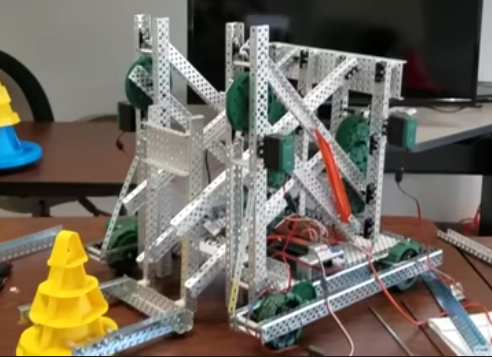

# Tuesday, 7th of May 2024
---
- **Aim:** To develop ideas for *VEX V5RC High Stakes 2024-2025*
- Ethan rewrote the `safe-vex` library *(a library that allows for writing the vex vrc robot code in rust through `FFI` bindings to the `VEX PROS C library`)* *(releasing version `3.0` of it)* to enhance the safety and reliability of managing operations with the `VEX PROS library` in rust though abstracing away any unsafe code with wrappers.
- Research towards methods of elevation and scoring continued. It was a debate between the use of a forklift, a conveyor or a four-bar linkage system.
- ## Brainstormed ideas include:
  - a four-bar linkage for elevation whilst paired with a conveyor
    - [https://www.youtube.com/watch?v=Bwf8m7enxTg](https://www.youtube.com/watch?v=Bwf8m7enxTg)
      - 
    - An intake system could be promoted for *‘grasping’* the rings into a conveyor *(perhaps through a flywheel)*
  - avoiding elevation due to the fact that once the match finishes, the robot is required to remain hanging without any external force *(eg from motors)* *(which can be very problematic)*
- Ethan started work on rewriting the robot code for this year
- Ethan was also experimenting with using the `Micro-SD` slot of the brain which would allow him to dynamically load configuration files on runtime to reduce the amount of times Ethan would have to recompile the robot code *(instead of recompiling everytime a setting was changed (which took a long time))*
  - Usage of the `Micro-SD` slot of the brain was attempted through the usage of the standard c library
  - ```rust
    use libc::{fopen, fclose, fprintf};

    let file = unsafe { fopen("/usd/file.txt", "wb") }; // create a new file
    if file.is_null() { return None }; // check for and handle errors

    unsafe { fprintf(file, "hello, world!") }; // write hello world to the file
    unsafe { fclose(file) } // close the file
    ```
