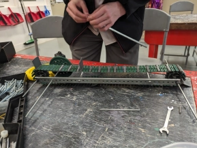

# Tuesday, 14th of May 2024
---
- **Aim:** To finalise ideas towards *VEX VRC High Stakes 2024-2025*
- The plan to construct a forklift system was disregarded as the method was found to be rather flawed
- On the contrary, it was decided that constructing a conveyor belt would be ideal, and a wiser choice.
- Hudson and Aaron began developing a rough structure of the conveyor belt
  - 
- To further commence with the usage of a conveyor belt, an intake system would also be implemented. Paired with a stake while holding grasp of a mobile goal, this setup would allow for scoring; with the intake grabbing onto and funneling the ring into the conveyor belt to be fed atop the goal; scoring.
- The design for the intake has yet been decided
- Ethan updated the `safe-vex` library version used in the robot code to the latest version (`v3.1`) without filesystem support as it proved to be too tricky and unreliable in it's current state *(perhaps due to a faulty sim-card or formatting issues)*
- For the next robotics sessions we will try to reinforce concrete ideas from our brainstorming; the intake, conveyor belt and stake grabbing mechanism.
- A strategy for autonomous is currently overlooked as it's far more important to get a working robot at all
