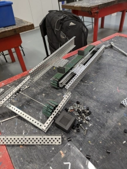

# Wednesday, 15th of May 2024
- **Aim:** To expand on final ideas; and begin constructing the conveyor
- Today, the process of building the conveyor belt had begun, though the kit was missing conveyor flaps
- Hudson and Aaron continued to construct the framework of the conveyor belt
- The belt was constructed by Daniel, consisting of a total of 95 flaps, with a range of alternating flaps every segment of 5 and or 6 chains
  - 
- Additionally, Ethan had also tested the experimental file system code with the new `1GiB` Micro-SD card *(provided by Aaron)*. The file itself was able to be written to without any errors, however reading the data back had failed when plugged back into a laptop.
- Ethan had decided that the `fs` feature of the robot was too unstable and unreliable and to be retired *(this feature may be revisited in future)*
- The work-in-progress conveyor belt would be placed near the floor and above the intake system and span around `15"` in height
- A frontal section of the robot was also discussed to determine wehether it would be beneficial if removed
- Within the two weeks, it was confirmed that for the upcoming competitions would rely on a conveyor system, abandoning the other past ideas
- Charlie and Ethan believed that it may be beneficial if the conveyor could be adjusted when attached
- After finishing the construciton of the conveyor system, we should test and experiment with the side lengths, implement some sort of intake system leading to the conveyor and build a basic goal grabber
