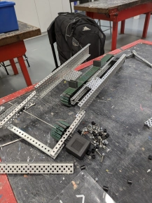
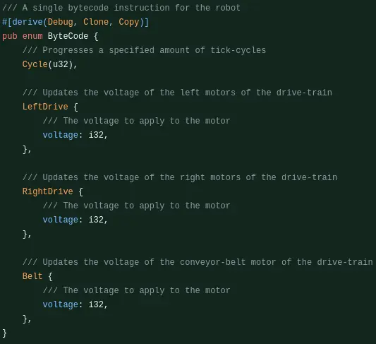

# Tuesday, 21st of May 2024
---
- **Aim:** To complete the conveyor belt and conduct tests
- ## Conveyor Belt
  - The structure of the conveyor belt had been completed by Hudson, Aaron, and Jake
  - It measured approximately `15”` in length, and was built along a structure of a lengthy C-channel piece
  - 
  - The C-channel within the middle was complemented with guard railings, securing any opportunity for a potential falling ring
  - Then, Daniel finished finalising the intergral betweens flaps for the conveyor, and as the delivery for conveyor flaps had swiftly arrived we were able to have an implementation of our conveyor belt.
- ## Programming
  - Ethan rewrote the robot code to use JIT-compiled bytecode as instructions
  - 
  - This would allow for the actions performed by the robot to be recorded and replayed during autonomous within a virtual machine
  - Autonomous is now able to be recorded efficiently, turned to bytecode to be interpreted on runtime for autonomous
- ## Intake
  - Aaron and Daniel began delving into an intake system, creating a prototype, with the intent to develop to method of 'sucking' or 'grasping hold' of scoring rings
- In future robotics sessions, we should innovate upon current ideas on the intake system, test driving with the new conveyor system, create a functioning autonomous script, a goal grabber, an intake system, and potentially a method of elevation
