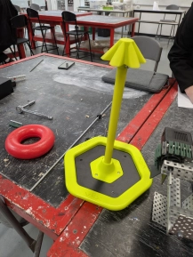
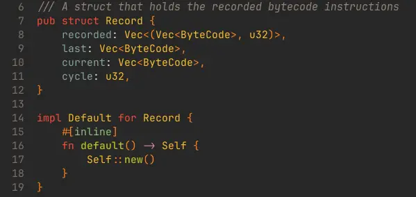

# Wednesday, 22nd of May 2024
---
- **Aim:** to conduct tests on the belt conveyor system, and implement intake designs
- ## Conveyor Belt
  - The conveyor belt system was thoroughly tested by feeding rings into the system and observing the outcomes
  - It was found that the system work perfectly and as intended
  - 
- ## Programming
  - Ethan began adding writing a system for recording the executed bytecode to generate an aseembly-like script of 'instructions' that, when copied into the source code of the robot, would get interpreted by a rust macro to create an array of bytecode to efficiently store them for execution during autonomous
  - 
  - This would allow for easily created autonomous routines as there was no need for *manual* programming *(though it was possible through changing or added instructions to the bytecode)* and could be instead easily recorded through the driver just driving the robot normally and have the actions be repeated with the exact timings for autonomous
  - In addition to this, Ethan also began thoroughly proof-reading over the old code and removed all of the unnesesary `Mutexe`s *(an old attempt at a solution to the robot not moving)*
