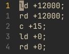

# Wednesday, 29th of May 2024
---
- **Aim:** To begin constructing the field
- ## Field
  - Today, the current *High Stakes* field and field equipment had arrived
  - Our team, alongside the other *Vex VRC* teams of [Highvale SC](https://www.highvalesc.vic.edu.au/) quickly began building the outer-walls of said field
  - It was quite a surprise to discover the height of the mobile goals; measuring a height of `14.5"`
  - This affected the results of the conveyor belt as the system ws unable to reach the required height when placed at the desired angle
  - It was also realised that some mechanism or force may be required to push the rings into the 'stakes'
- ## Autonomous
  - Some ideas towards a new autonomous routine were discussed, the main one being considered was "switftly movnig towards the centre and taking control of `(MG3)`"
  - 
- In future robotics sessions, we should complete the construction of the field and develop new ideas for the autonomous routine
