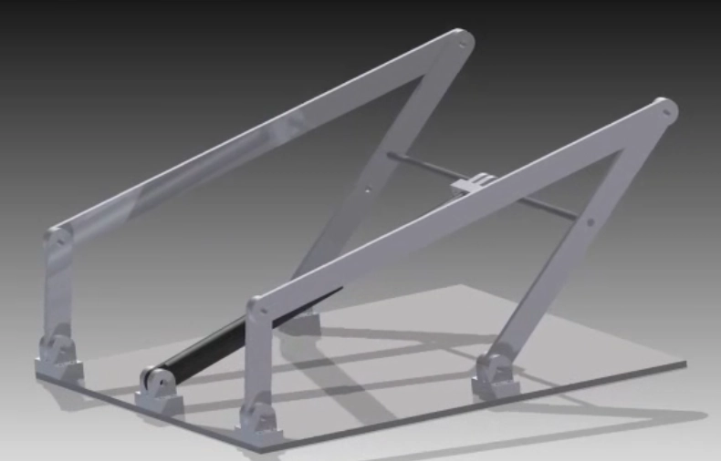
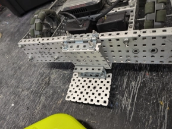

# Tuesday, 4th of June 2024
---
- **Aim:** To finalise the construction of the field
- ## Field
  - The progress on building the field was half completed, a majority of the goals had been assembled and attached to the dedicated locations; walls, field floor, and other misc places.
  - Progress on the construction of our robot has slowed down due to a large proportion of our team focusing on construcing the field
- ## Conveyor Belt
  - Hudson had began to make the conveyor system thinner and lighter for better overall performance and balance
  - The attachment of such conveyor is still a work-in-progress
  - Some ideas for attaching the conveyor belt to the robot include:
    - **A Fold**; *suggested by Ethan*
    - **A four-bar** linkage; *suggested by Daniel*
      - 
    - **A Scissor Lift**; *suggested by Aaron*
  - Another idea was to reuse our old concept used for the previous *Over and Under* games; supplied with a blocking mechanism
    - The blocker would be powered by a motor allowing it to span a right angle of `90°` within a second
  - Expanding on the idea of the fold:
    - Ethan's idea comprised of a mechanism similar to the blocker
    - The conveyor belt would be put to rest while controled by a flap/fold
    - This would act similar to a door-hinge
    - 
- ## Programming
  - The recording code has been revised yet again by **Ethan**
- As of now, we plan to begin constructing an intake based off of previously found inspirations and prototypes
- Furthermore, the field has almost been fully constructed thanks to **Issac** and **Charlie**
