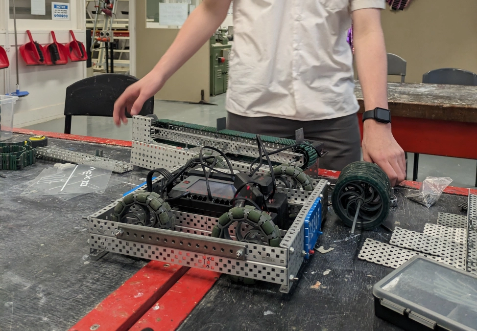
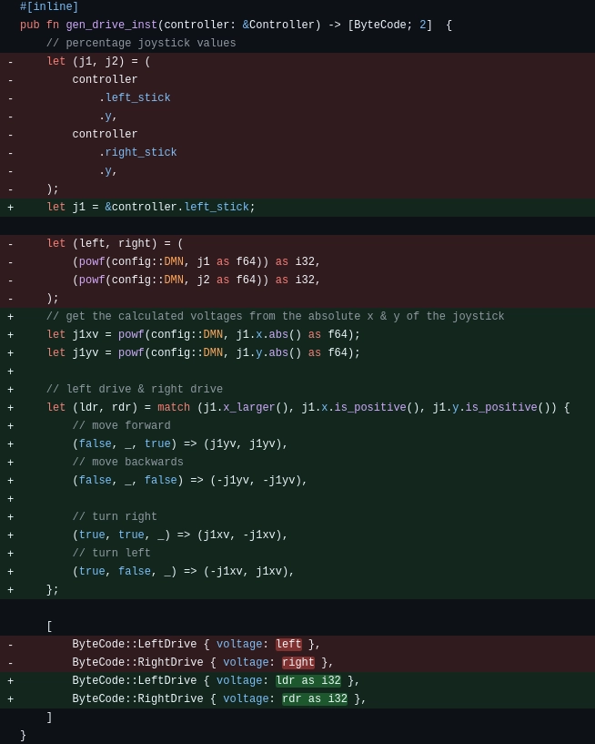

> *the time gap between entries is due to the school holidays where we didn't have access to the robot or the school*

# Wednesday, 24th of July 2024
---
- **Aim:** To refine conveyor belt ideas
- The conveyor belt has been changed from being completely solid to only two bars that cover the same area with much less weight; also allowing for discs to slid easier across it
- We've also once again read the rule book and started developing a more mature game strategy than the one we had before
  - We did this through summarising important aspects of the rule-book and informing the entire team about these aspects
- ## Competition
  - It had been recently announced that the next robotics competition was in **2 WEEKS**
  - Due to such, competition preparation is paramount and a bullet-proof game strategy for our robot must be developed alongside
    - A conveyor belt that needs to be added to the robot
      - 
    - An intake that needs to be developed *(though of less priority to the others)*
    - And a goal grabber needed to be implemented
- ## Programming
  - Ethan had also implemented new controls for the robot where all the robot's drivetrain's movement is controlled by one joystick rather than two
    - This would free up one joystick along with allowing for more natural movement *(eg pushing the joystick left would turn the robot left)*
  - Ethan had also implemented exponential movement for the joystick; allowing for both precision and speed & power *(when necessary)*
  - 
