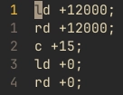
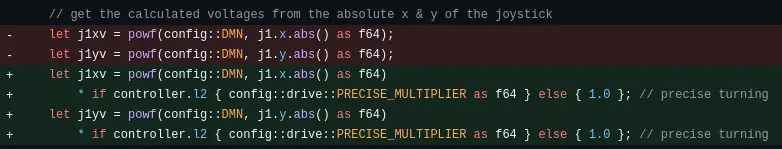

# Wednesday, 2nd of August 2024
---
- **Aim:** To continue working on and hopefully complete our ideas before the next competition
- It was discovered this session that the next robotics competition was in fact **NOT** a week away *(that was the next iq competition)*, but rather in **3 WEEKS** which allows us much more time to complete the robot
- ## Conveyor Belt
  - Work continued on making the conveyor belt lighter through using two long vertical bars instead of multiple horizontal bars as a lower support for the discs *(as mentioned previously)*
  - We also improved the guard rails to keep the disc within the conveyor belt while keeping the weight down
- ## Programming
  - There was yet another bugfix done by Ethan for the robot's ability to record routines for autonomous
  - At this point in time, the robot can execute those routines perfectly to the right timings if the routines are hand-written
  - 
  - Though the routines generated by the recording section of the robot code is incorrect and needs to be fixed
  - A new 'precise mode' was added to the robot which, when the allocated button was held down, the robot would reduce it's speed in all forms *(like lshift (sneaking) in minecraft)*
  - 
  - The controls of the robot were also slightly tweaked to reduce the turning speed of the robot to allow for yet more precision
