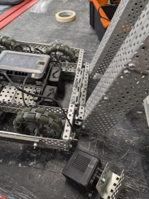
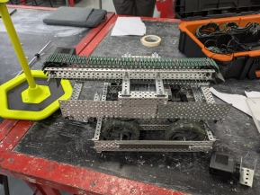
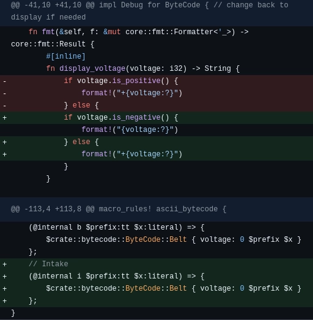

# Wednesday, 7th of August 2024
---
- **Aim:** To attach the completed conveyor belt onto the main body of the robot
- ## Conveyor Belt
  - For the arduous task of actually attaching the conveyor belt onto the rest of the robot, it was suggested that we could use *Vex VRC compatible* door-hinges
  - After testing out the idea, it was found to be largely a success as the robot was now *finally* in one piece
  - 
  - There is a slight problem where, when fully extended like shown in the photo above, the robot tilts and is highly unstable
  - So, for the time being, the conveyor belt will be held in place with a support to prevent such a problem
    - 
    - Though it was suggested by Ethan that it would be possible to move the conveyor-belt with a motor to which Aaron disagrees, stating that "it would burn out the motor"
- ## Programming
  - Some minor bugfixes were applied to the exection and recording of bytecode as both the generation of it was missing a `+` token which was necessary and the execution of it executed intake instructions as belt instructions
  - 
- In future robotics sessions, we will try to polish up the robot and get our driver to test it before the competition
- Finalisation and the printing of this very logbook is also a priority
