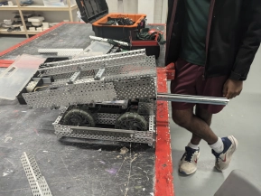
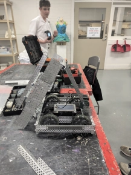
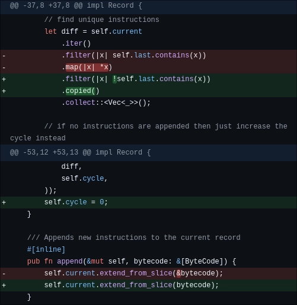

# Wednesday, 21st of August 2024
---
- **Aim:** To explore other methods of attaching the conveyor-belt and to also prepare for the upcoming competition
- ## Conveyor Belt
  - The piece of metal that had previously propped up the conveyor-belt has been removed in favour of Ethan's idea:
  - A motor connected to a bar that would lift and drop the conveyor when desired *(as shown below)*
  - 
  - 
- ## Programming
  - There were some more minor changes and bugfixes to the recording code *(yet again)* in which the code had been simplified through suggestions from `clippy`
  - 
- ## Driving
  - After months of contruction of the robot itself, we were finally able to get Charlie to test-drive it
  - After about an hour of such test-driving and a few minor tweaks to the feel / sensitivity of the controller, Charlie was confident that he would be able to drive the robot effectively on the day of the competition
> *Just as a note, Hudson took the robot home the day before the compeition for some minor changes so the robot may look slightly different during the actual competition*
