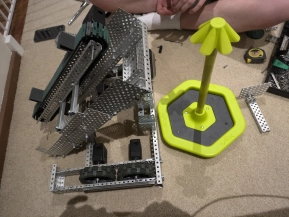

# Friday, 23rd of August 2024
---
> *the day before the competition*
- **Aim:** To add some components to the robot that would be nice to have, such as a goal-grabber and intake
- some *minor* changes were made to the robot
  - 
- ## Conveyor Belt
  - The motor support of the conveyor belt *(suggested by Ethan)* was found to be outside the size limits of the robot and therefore must be remvoed
  - The old support would be replaced by bars that cemented the conveyor to the actual structure of the robot
  - 
- ## Goal Grabber
  - A 'goal grabber' was also added to the robot to add extra stability whilst scoring and to also be able to move the *mobile* goals around at will
  - It was constructed through having a motor be connected to a 'hook' constructed from various metal parts and screws
  - 
  - When the motor is spun downwards, it would hook onto the goal and also pull the tip of the goal towards the robot to both control it and also score easier
- ## Intake
  - An intake for the robot to make it easier to take posession of the rings was planned though could not be completed before the competition
  - In future robotics sessions however, we will ensure to get a functioning intake before the state competition
- ## Programming
  - The robot's code was also updated to accomidate for the changes to the robot
  - 
- There's not much more we can do to the robot as the competition is **TOMORROW**, though we will get Charlie to practice more on the day
- There is also a *slight* chance the robot may not move *at all* during the competition as that was a recurring problem we had last year *(though it should be fixed now)*
