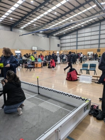
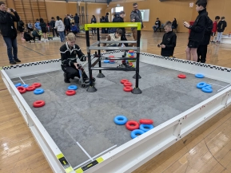
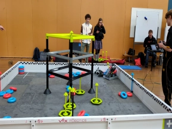
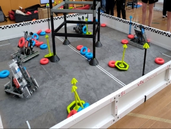
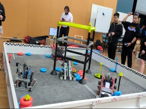
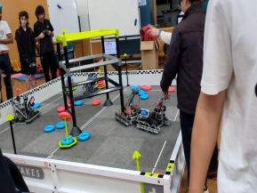
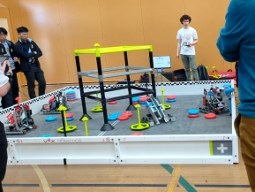
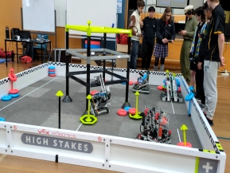
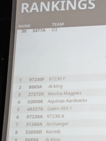
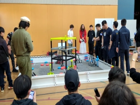

# Saturday, 24th of August 2024
# **(The CopperField College Competition)**
---
On August 24th, Team 97230F competed at their first competition of the 2024-25 High Stakes season. This was the Blended Tournament of Copperfield College, Sydenham, Melbourne.

Hosted on a Saturday, team members had to manage their own way towards the competition.

The competition consisted of three parts, qualifiers, skills and the finals. In qualifiers, each team would take part in a minimum of six matches, in a game between two alliances.

**The summary for the qualifiers lies below:**

## Terms
---
- **nP:** not present
- **mV:** minor violation
- **MV:** major violation
- **AT:** Autonomous points
- **R:** scored rings
- **TR:** scored top rings
- **C:** climbing (of ladder), levels are represented by; `C`, `2C`, `3C`.

# Qualifiers
---
## Qualifier Match 5
---
### Teams
<!-- The only nicely formatted table lmao -->
| RED ALLIANCE | BLUE ALLIANCE |
| ----------------------------------------------- | ------------------------------------------------ |
| **97230F** *(our team)*                         | 3477A *`(nP)`*                                   |
| 1002X *`(nP)`*                                  | 7479C                                            |

### Summary
The match began with Team **1002X** of Red Alliance and Team **3477A** of Blue Alliance being not present to the field due to unknown reasons. Scoring wise, both red and blue alliances had tied during the Autonomous period, thus both sides were given 3 of the 6 Autonomous points.

One ring was scored into a mobie goal by **Charlie**, however, Team **7479C** managed to gain control over the goal stake, and guarded the negative corner to the end. 

*(Only points from contributing rings can be deducted by those rings scored within the negative corner, thus resulting in no deductions)*

### Scoring
3 - **Tie** - 3

| RED ALLIANCE | BLUE ALLIANCE |
| :-: | :-: | 
| 3 `AT` | 3 `AT` |
| 1 `R` *(`-1`)* | 0 `R` |
| 0 `TR` | 0 `TR` |
| no `C` | no `C` |

## Qualifier Match 14
---
### Teams
| RED ALLIANCE | BLUE ALLIANCE |
| --- | --- |
| **97230F** *(our team)* | 96498C *`(mV)`* |
| 46327G *`(mV)`* | 27272S |

### Summary
Both red and blue alliances had tied during the Autonomous period, with no team managing to score any points, thus both sides were given 3 of the 6 Autonomous points.

During the driver-control period, there were a number of rings scored. It was observed that ramming into goals with rings who were not fully encircled *(the ring was lying upon the stake)* allowed the ring to be scored. **Charlie** managed to score multiple rings with the method above. Up until the last ten-fifteen seconds, the positive corners were 'protected,' but had been contacted by Teams **46327G**  and **96498C**, given that this could have affected the outcome of the game, each violating team was provided with a minor violation.

### Scoring
15 - **Win** - 9

| RED ALLIANCE | BLUE ALLIANCE |
| :-: | :-: | 
| 3 `AT` | 3 `AT` |
| 0 `R` | 0 `R` |
| 3 `TR` *(`1*2`)* | 1 `TR` *(`1*2`)* |
| no `C` | no `C` |

## Qualifier Match 17
---
### Teams
| RED ALLIANCE | BLUE ALLIANCE |
| --- | --- |
| 7479M | **97230F** *(our team)* |
| 96498D | 52050E |

### Summary
Both red and blue alliances had tied during the Autonomous period, with no team managing to score any points, thus both sides were given 3 of the 6 Autonomous points.

During the period of driver control, all points had been obtained by *our* team, as Team **52050E**  of Blue Alliance had been pressuring the opposing side from reaching/scoring any rings. This was a well-planned strategy, leading to Red Alliance to land no rings onto stakes throughout the whole period.

### Scoring
3 - **Win** - 7

| RED ALLIANCE | BLUE ALLIANCE |
| :-: | :-: | 
| 3 `AT` | 3 `AT` |
| 0 `R` | 1 `R` |
| 0 `TR` | 1 `TR` |
| no `C` | no `C` |

## Qualifier Match 29
---
### Teams
| RED ALLIANCE | BLUE ALLIANCE |
| --- | --- |
| **97230F** *(our team)* | 8689A |
| 8683A | 7479Y |

### Summary
With the autonomous of Team **8683A**, 3 rings had been scored as top rings compared to the opposing 2 from the Blue Alliance, allowing all 6 Autonomous points given to Red Alliance. The strategy was simple, Daniel and members of Team **8683A** discussed on fully defending the positive corners. This prevented the opposing alliance with opportunities to gain double the number of points, and gained easy access for our alliance. The defence lasted up until the last few seconds of the match, where the positive corners had been now *'protected'*.

Charlie managed to score a ring as a top ring during the last 5 seconds of time.

### Scoring
44 - **Win** - 11

| RED ALLIANCE | BLUE ALLIANCE |
| :-: | :-: | 
| 6 `AT` | 0 `AT` |
| 10 `R` *(`10*2`)* | 5 `R` |
| 4 `TR` *(`2*2`)* | 2 `TR` |
| no `C` | no `C` |

## Qualifier Match 38
---
### Teams
| RED ALLIANCE | BLUE ALLIANCE |
| --- | --- |
| 97230A | **97230F** *(our team)* |
| 52050D | 3477B |

### Summary
As of *Qualifier Match 38*, Team **97230A** was placed ahead of our team, though this lead was cut short after the following match. Beginning with the Autonomous period, this was won by the Blue Alliance as contacting the ladder contributed to autonomous win factors. In this match, the strategy was to score in separate mobile goals, allowing for triple the scoring points given by top rings, this can be observed with the Blue Alliance scoring 3 top rings, whilst the Red Alliance consisted of 2 regular scored rings and 1 top ring.

### Scoring
5 - **Win** - 15

| RED ALLIANCE | BLUE ALLIANCE |
| :-: | :-: | 
| 0 `AT` | 6 `AT` |
| 2 `R` | 0 `R` |
| 1 `TR` | 3 `TR` |
| no `C` | no `C` |

## Qualifier Match 41
---
### Teams
| RED ALLIANCE | BLUE ALLIANCE |
| --- | --- |
| 3477C | **97230F** *(our team)* |
| 31260Z | 27272X |

### Summary
This was the final qualifier of Team **97230F**, as of *Qualifier Match 41*, the team was ranked **first** with `4W-0L-1D`.

The match began with the Autonomous Win Points given towards the Blue Alliance, due to one of Red Alliance’s robot not moving during the time period. Scoring wise, **Charlie** managed to score 2 rings, as he improved more in driving the robot as more practice was conducted during games. In the end, Red Alliance was only able to score 1 ring, acting as a top ring, providing 3 points. However, near the end, Team **31260Z** managed to push one of the mobile goals with a scored blue top ring into a negative corner, deducting 3 points from our score.   

### Scoring
3 - **Win** - 10

| RED ALLIANCE | BLUE ALLIANCE |
| :-: | :-: | 
| 0 `AT` | 6 `AT` |
| 0 `R` | 1 `R` |
| 1 `TR` | 3 `TR` *(`-1`)* |
| no `C` | no `C` |

# Finals
---
After the six qualifier matches, Team **97230F** was ranked first with `5W-0L-1D`, with 11 win points as opposed to Team **8683A**'s 10 win points. Ranking first in qualifiers allowed our team to be the first to pick teams for the finals of the tournament. After discussing between our team, it was decided that Team **27272X** would be chosen as our alliance member. 

The finals consisted of 8 teams competing against one another in four sets of brackets, beginning with the quarterfinals.

## Quarter-Finals
---
### Teams
| RED ALLIANCE | BLUE ALLIANCE |
| --- | --- |
| **97230F** *(our team)* | 52050D |
| 27272X | 7479A |

### Summary
The quarterfinals match was brief, with all 6 of Autonomous points provided towards the Red Alliance, we were found ahead in position. The game was mainly defence, with both Red robots attempting to score whilst preventing the opposing alliance from accessing the positive corners. Inetivably, this was stalled until then end, giving Red Alliance the win in quarterfinals, and would then move onto the semifinals.

### Scoring
14 - **Win** - 7

| RED ALLIANCE | BLUE ALLIANCE |
| :-: | :-: | 
| 6 `AT` | 0 `AT` |
| 2 `R` | 1 `R` |
| 2 `TR` *(`2*2`)* | 2 `TR` |
| no `C` | no `C` |

## Semi-Finals
---
### Teams
| RED ALLIANCE | BLUE ALLIANCE |
| --- | --- |
| **97230F** *(our team)* | 8689A |
| 27272X | 31260A |

### Summary
Unfortunately, the journey was ended at semifinals, partially due to the burnout of motors of our allied team. The match was a game of 1 vs 2, with an effort of our team managing to successfully score a top ring. 

It was a great start to the season, by ending first in terms of qualifications, and placed third overall, given that the semi-finalists were right behind the tournament winners.

### Scoring
6 - **Loss** - 19

| RED ALLIANCE | BLUE ALLIANCE |
| :-: | :-: | 
| 0 `AT` | 6 `AT` |
| 0 `R` | 2 `R` |
| 1 `TR` *(`1*2`)* | 2 `TR` *(`1*2`)* |
| no `C` | no `C` |

# Conclusion
---
The first competition had allowed the team to gain a good insight on what other teams have achieved and were to develop strategies to use opposing others. Some strategies include, defending positive corners, scoring across all empty mobile goals, and an understanding of what may result in violations. The next competition is set to be on *Monday, 9th of September*, of the *Blended Tournament of Berwick College*, Berwick, Melbourne; and what was lost at the Sydenham shall be granted at the next, with more innovations and improvements allocated to our robot. The goal is to aim for reaching world-level of the *VEX V5RC’s game of High Stakes*.
