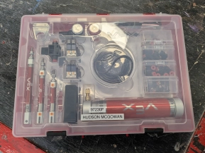
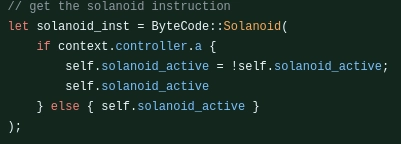
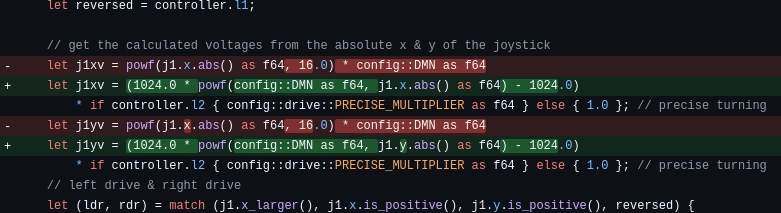

# Thursday, 5th of September 2024
---
- **Aim:** To experiment with the newly-arrived pneumatics kit
- ## Pneumatics
  - Recently the pneumatics kit that we bought *(funded by ourselves and not the school)* arrived which allowed us to experiment with it as our school has never had the funds to buy one before
  - 
- ## Programming
  - For pneumatics, Ethan added *experimental* support for it in the robot code
    - 
    - ```rust
      // update the pneumatics solanoid
      ByteCode::Solanoid(is_active) => { solanoid.get().map(|solanoid| solanoid.write(is_active)); },
      ```
    - The code written may or may not work as Ethan cannot test it without the pneumatics being fully assembled with solenoids and everything
  - Ethan also changed the exponential algorithm for the joystick to be \\( y = 1024a^x \\) instead of the previous \\( y = a^x \\) to allow for a smoother, less exponential curve for more ergonomic control of the robot
    - 
  - The controls for the conveyor belt were also moved from `x` & `b` to `r1` & `r2` which are more logical buttons for the conveyor belt
  - The old code for the *mogo* *(mobile goal grabber)* was removed as the pneumatics was planned to replace it
