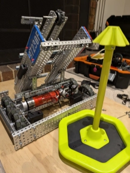

# Friday, 6th of September
---
- **Aim:** To fully assemble the pneumatics of the robot along with the code to run such
- *The robot before pneumatics*
  - 
- ## Pneumatics
  - After taking the pneumatics out of the kit and reading / watching some tutorials on how they work, Hudson constructed a little test station for the pneumatics with the pressurised tank, solenoid and piston
  - 
  - Though, after plugging in everything, running the code, and hitting the `X` button *(for pneumatics)*, *nothing* happend
    - This turned out to be a bug in the code that would be fixed by Ethan and explained in depth in the next section
  - After the program was working perfectly, Hudson inserted the pneumatics test-setup into the robot to replace the previous *mogo* *(mobile goal grabber)*
  - 
  - After the pneumatics was successfully inserted into the robot, Hudson began building a *hook* that would grab hold of the mobile goals when the piston of the pneumatics was activated *(as seen below)*
  - 
- ## Programming
  - As mentioned above, the *experimental* code for pneumatics did not work as intended and the piston didn't fire for some reason
  - It was later discovered by that each lettered ADI port of the brain corresponded to a number *(`A` == `1`)* and that for *ADI Digital Output* ports the expander port value is `22`
    - These values were discovered through brute-forcing all the ports until one worked
  - Due to the above discovery, Ethan updated the `safe-vex` library *(`v3.2.0`)* to have support for 'safe' constructions of these ADI port devices without the need to encode the values like shown above; you can just instead use the enum variant `A` for example
    - 
- Before the next competition at *Berwick College* on **Monday**, we'll try to refine the *mogo* and also test autonomous code
