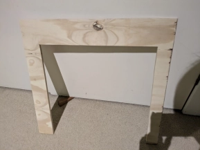
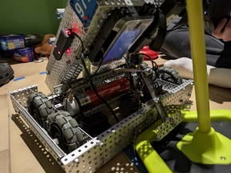
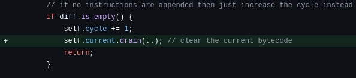

# Sunday, 8th of September 2024
---
- **Aim:** to refine the *mogo*, scoring and also test autonomous recording
- A sizing guide to better size our robot was constructed this session by Hudson from plywood
  - 
- ## Mogo / Pneumatics
  - 
  - The mogo has been further refined from last time as the angle of it has been adjusted to allow for both effective grabbing of the mobile goals and also enough clearance to not get stuck holding the goal
  - There have also been side 'flares' that guide the mobile goals to the mogo which aid greatly in the scoring of rings as the location of the mobile goal is now much more standardised
- ## Programming
  - After completing the *mogo* we had time left over so Ethan was allowed to test *(yet again)* the recording of bytecode for autonomous
  - After recording and executing an autonomous routine, it was found that the belt wouldn't stop spinning and the solenoid would also never disengage even though the driver had explicitly done so during the recording process
  - After about an hour of testing and debugging, it was found that it was *YET ANOTHER* single line bug that caused the above problem along with numerous other problems
  - 
  - And once this one bug was fixed, autonomous worked **FLAWLESSLY**
    - *"YOOOOOOOOOOOOOOOOOOOOOOOOOOOOOOO" - Ethan*
