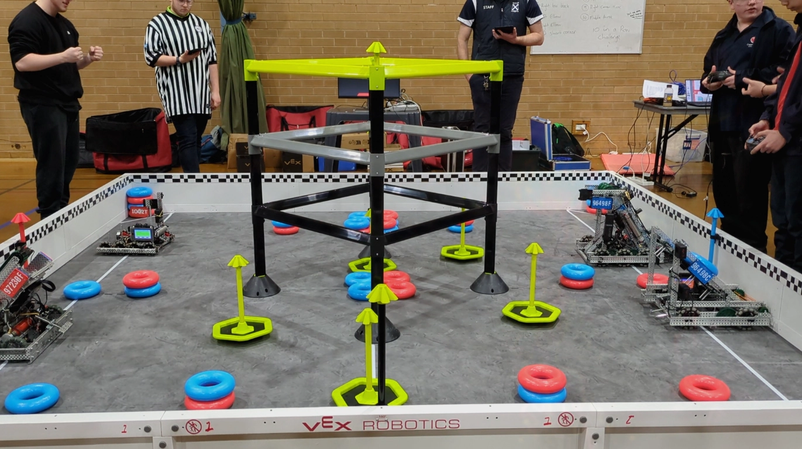

# Monday, 9th of September
# **(The Berwick College Competition)**
---
On September 9th, Team 97230F competed at their second competition of the 2024-25 High Stakes season. This was the Blended Tournament of Berwick College, Berwick, Melbourne. 

The competition consisted of three parts, qualifiers, skills and the finals. In qualifiers, each team would take part in a minimum of six matches, in a game between two alliances. However, the competition had ended with systematic errors cutting short of the final qualifier matches, alongside the official alliance selection matches. 

**The summary for the qualifiers lies below:**

## Terms
---
- **nP:** not present
- **mV:** minor violation
- **MV:** major violation
- **AT:** Autonomous points
- **R:** scored rings
- **TR:** scored top rings
- **C:** climbing (of ladder), levels are represented by; `C`, `2C`, `3C`.

# Qualifiers
---
## Qualifier Match 3
---
### Teams
| RED ALLIANCE | BLUE ALLIANCE |
| --- | --- |
| **97230F** *(our team)* | 73005A |
| 96498D | 7479A |

### Summary
 The match began with *Autonomous* resulting in a win for the Blue Alliance due to the team's autonomous having "`[broken]` the plane" over the Autonomous Line during their routine *(this issue with our autonomous routine was sw changed by our program as to prevent any futher penalties)*. The robots of Teams `96498D`, and `73005A` had minimal ability to score; leading to low scores for both alliances. During the match, Charlie managed to score a total of one ring due despite interference from our opponents. Unfortunately, this match ended with a loss for our alliance. 

### Scoring
3 - **Loss** - 6

| RED ALLIANCE | BLUE ALLIANCE |
| :-: | :-: |
| 0 `AT` | 6 `AT` |
| 0 `R` | 0 `R` |
| 1 `TR` | 0 `TR` |
| no `C` | no `C` |

## Qualifier Match 9
---
### Teams
| RED ALLIANCE | BLUE ALLIANCE |
| --- | --- |
| 97230D | **97230F** *(our team)* |
| 7479Y | 7479M |

### Summary
As neither of the red or blue alliances could score more points than another, the *Autonomous* period ended with a tie; awarding both alliances `3` autonomous points.

During the driver-control period, there were a total of `2` rings scored by our Blue Alliance alongside a positive multiplier due to it being pushed into one of the positive corners.
- *It was also discovered that if the pneumatics were actuated within the last millisecond of the match, the pneumatics solenoid would toggle on and off repeatedly at a high rate even while the robot was disabled; draining battery and emptying the air-cylinder*
  - *This can be disregared as it doesn't affect the actual match itself as it may only occur after the match is over and the time inbetween solenoid actuations is far too short for any pistons to be moved*

### Scoring
3 - **Win** - 12

| RED ALLIANCE | BLUE ALLIANCE |
| :-: | :-: | 
| 3 `AT` | 3 `AT` |
| 0 `R` | 0 `R` |
| 0 `TR` | 2 `TR` *(`1*2`)* |
| no `C` | no `C` |

## Qualifier Match 15
---
### Teams
| RED ALLIANCE | BLUE ALLIANCE |
| --- | --- |
| **97230F** *(our team)* | 96498C |
| 1002T | 96498F |

### Summary
As neither of the red or blue alliances could score more points than another, the *Autonomous* period ended with a tie; awarding both alliances `3` autonomous points.

Due to neither of the red or blue alliances scoring *any* rings onto the mobile or stationary goals, the match entered with a tie-breaker in which the team with the largest amount of mobile goals at their end would win the match; fortunately, our Red Alliance had managed to gather `3/5` mobile goals; winning us the match.

### Scoring
3 - **Tie-Breaker Win** - 3

| RED ALLIANCE | BLUE ALLIANCE |
| :-: | :-: |
| 3 `AT` | 3 `AT` |
| 0 `R` | 0 `R` |
| 0 `TR` | 0 `TR` |
| no `C` | no `C` |

## Qualifier Match 18
---
### Teams
| RED ALLIANCE | BLUE ALLIANCE |
| --- | --- |
| 7479C | **97230F** *(our team)* |
| 7479Y | 3477A |

### Summary
Due to the disabling of our autonomous routine and a failed attempt of scoring by our team-mate, the Blue Alliance won the `6` Autonomous win-points due to being able to score one ring on an *Alliance Stake*.

During the match, the precise controls implemented by Ethan allowed for easier maneuvering for Charlie; resulting in our robot scoring `1` ring during the match.

Overall, the match was played rather defensively, with both teams pressuring one another and preventing scoring by ramming and obstruction.

Unfortunately, due to losing the *Autonomous win-points*, the Blue Alliance had won the match.

### Scoring
12 - **Loss** - 6

| RED ALLIANCE | BLUE ALLIANCE |
| :-: | :-: |
| 6 `AT` | 0 `AT` |
| 0 `R` | 0 `R` |
| 2 `TR` | 2 `TR` |
| no `C` | no `C` |

## Qualifier Match 28
---
### Teams
| RED ALLIANCE | BLUE ALLIANCE |
| --- | --- |
| 1002S | **97230F** *(our team)* |
| 73005B | 7479B |

### Summary
The autonomous period of the match had ended with a draw due to neither of the red or blue alliances having a *working* autonomous routine.

During the match, the main strategy for our team was to score in separate mobile goals; allowing for triple the scored points given by the top rings.

Due to the Red Alliance having minimal ability to score rings, the round mainly consisted of pushing and ramming; with the opposing team attempting to obstruct any scoring. However, despite their obstruction, two top rings were still able to be scored; securing our win for the match.

### Scoring
3 - **Win** - 9

| RED ALLIANCE | BLUE ALLIANCE |
| :-: | :-: | 
| 3 `AT` | 3 `AT` |
| 0 `R` | 0 `R` |
| 0 `TR` | 2 `TR` |
| no `C` | no `C` |

## Qualifier Match 34
---
### Teams
| RED ALLIANCE | BLUE ALLIANCE |
| --- | --- |
| **97230F** *(our team)* | 96498E |
| 1002B | 1002X |

### Summary
After *Qualifier Match `32`*, the matches had been delayed due to technical difficulties. In the end, these issues had not been resolved, thus, matches after *Qualifier Match `32`* were cancelled.

The referees continued the competition by hosting different matches that would not affect the placements of the current teams.

# Conclusion
---
Our second competition at Berwick college allowed ourteam to further understand both the game and what other teams have achieved and developed. The competition had also allowed us to play against other actual opponents; exposing bugs, errors, faults and short-comings in both the code and design of the robot that we will **ensure** to fix before the next tournament *(the nationals qualifier at **Rivercrest Cristian College**)* to hopefully make it to nationals then worlds.

## A Discovered Glaring Issue
---
The largest discovered issue with our robot was with the *new* pneumatics mogo *(mobile goal)* grabber. As, when testing the new design, we had tested it on either smooth tiles or smooth floorboards that our school provided and had therefore not accounted for the inclusion of friction on the foam tiles of the competition and the mogo would just slip out under the clamp; this would soon be fixed relatively quickly in later entries.
