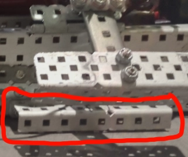
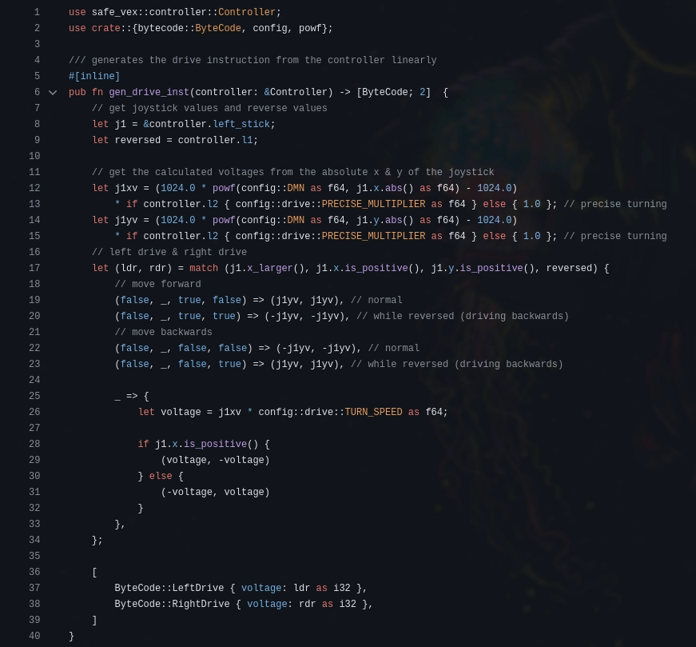
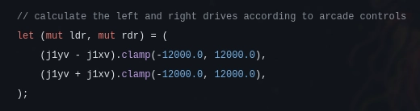

# Tuesday, 10th of September 2024
---
- **Aim:** To fix the issue where the mogo would slip out of the mogo-grabber due to friction and to also test some new more ergonomic controls *(arcade drive)* for the robot
- ## Mogo-Grabber Issues
  - As mentioned previously, we had a problem with the mogo-grabber where the mogo would slip out of it while the robot was driving
  - This flaw had been previously overlooked due to testing of our robot's mogo-grabber being performed upon smooth surfaces where friction had not been a variable to account for
  - Though, after throurough testing of the robot on the *VexVRC* legal foam tiles, we found the issue to be the mogo tilting towards the robot and slipping out of the mogo-grabber clamp whenever the robot moved backwards
  - This problem would be solved through adding a singular piece of metal that simply prevented the mogo from tilting *(as the base was previously uneven)*
  - 
- ## Experimental New Controls
  - Our programmer Ethan had recently implemented a new style of robot control *(arcade drive)* that he promised would be more ergonomic than what we previously had
  - The previous implementation of robot controls had only 4 different states for the controller: forwards, backwards, left and right, and the percentage of activation for the controller would be passed through an exponential function to get the final voltage for each of the motors
    - 
  - The new **arcade controls** wouldn't be limited to only 4 different states and would instead have a blend between the forwards and turning motions, so a diagonal on the joystick, while previously it would toggle between forwards or turning *(depends on which-ever is closer)*, it would now, with **arcade controls**, be a slower turn depending on the activation ratio between the `x` and `y` of the joystick; allowing for a smoother and more intuitive control algorithm for the robot
    - 
  - After trying out the new controls, **Charlie** suggested to Ethan that he should add some 'continuity'/state to the controls to make it smoother, so if you were driving backwards and turning, you would remain driving backwards unless you let go of the controller
    - Ethan would go on to implement this feature before the next robotics club session
