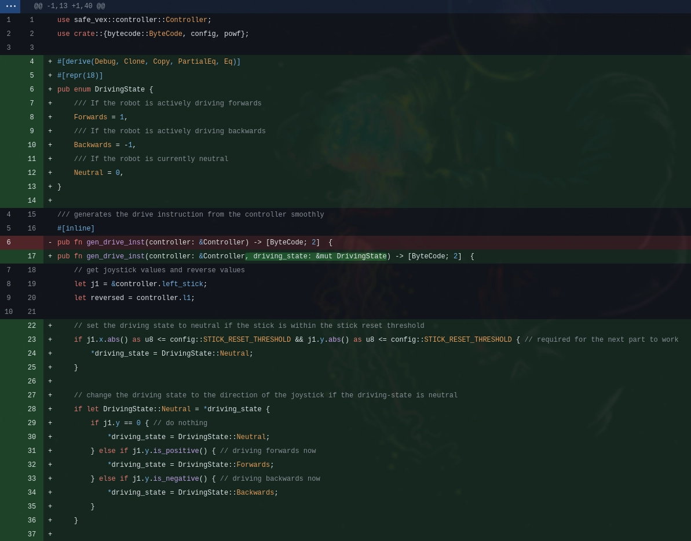
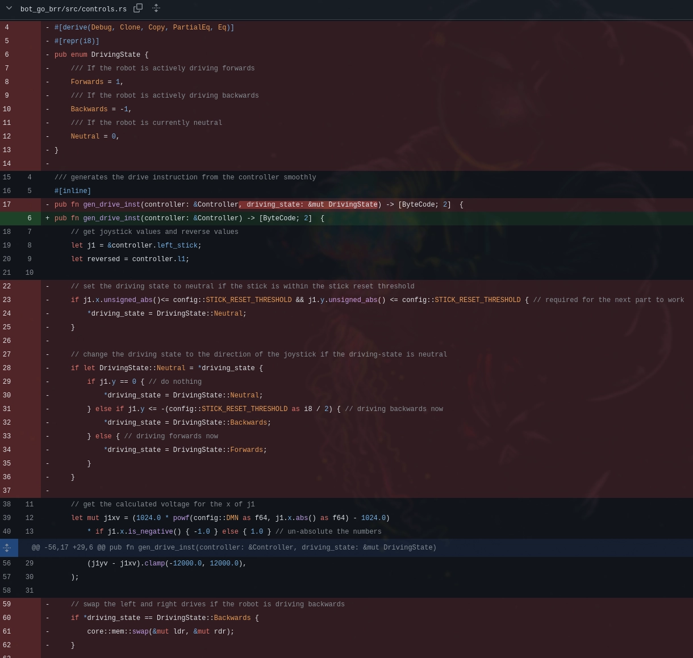
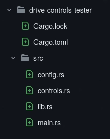
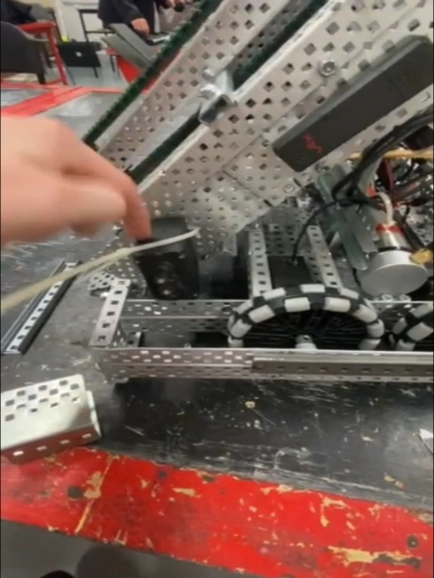

# Wednesday, 11th of September 2024
---
- **Aim:** To test the newer arcade controls with state, and to also start working on 6-motor chain drive
- ## Stateful Arcade Controls
  - After Charlie suggested to Ethan that he should add state to the arcade controls so that you keep moving in the same direction relative to when you started turning unless the joystick reached within a threshold near `(0,0)` of the joystick, Ethan quickly implemented it before this robotics session to test it out
  - 
  - After testing the new arcade drive for a while, Charlie concluded that the new driving was infact *worse* than the previous arcade control as the ***hidden*** state of the joystick caused unintuative and unexpected '*smoothing*' movements to occur while driving
  - The state was then removed from the arcade controls by Ethan, in favour of simplifying the original arcade code to be more consistent
  - 
- ## Drive Controls Testing Code
  - While developing the new arcade controls without *physical* access to the robot, Ethan had to get creative with how he could somewhat test the behaviour of his drive code
  - Ethan did this through *simulating* a robot and a controller that used the same functions for the drive code and outputed the generated voltages for each of the motors alongside the 'joystick' input
  - 
- ## 6 Motor Drive
  - A feature that was consistently requested by Ethan for the robot was 6 motor drive as he had noticed how in previous games, our robot would either get moved by or just obstructed/blocked by an opposing robot which is less than ideal when trying score
  - After the other core features of the robot were completed, Hudson was finally able to start working on the 6 motor drive
  - Though, problems soon arose when we weren't able to actually fit the extra motors into the drive-train of the robot which would make gear-drive extremely complicated and hard to implement
  - 
  - These problems, however, could both be solved with using **Chain Drive** instead, where the extra motors could be placed elsewhere on the robot and be chained to the drive-train
    - *This does come with the downside that the chain may snap during a competition thought after many strength tests, it seems rather unlikely for the robot to even come close to the failure point of the chain*
  - It was also decided to use grey anti-static oni-directional wheels instead as they were slimmer and smaller to allow more space for the chain and chain-gears
