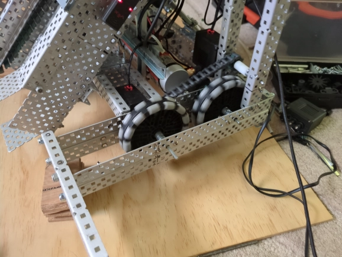
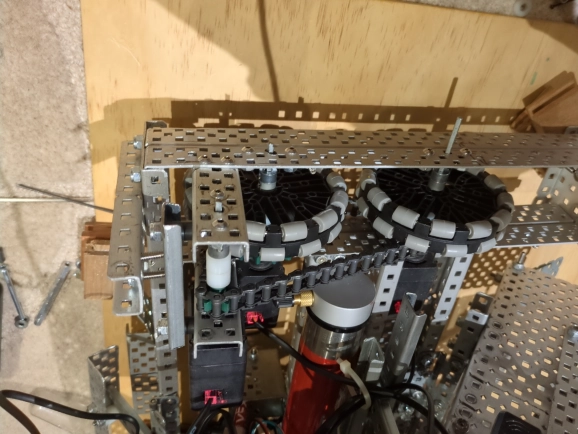
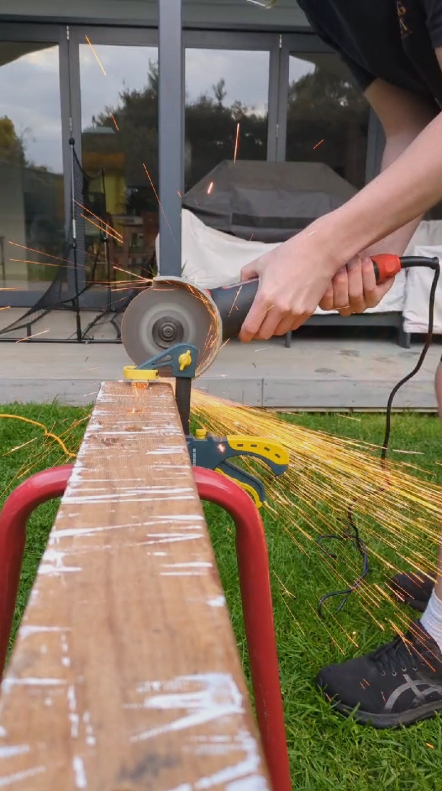
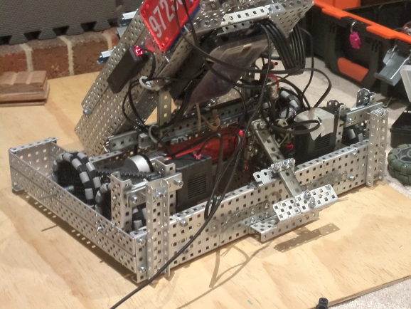
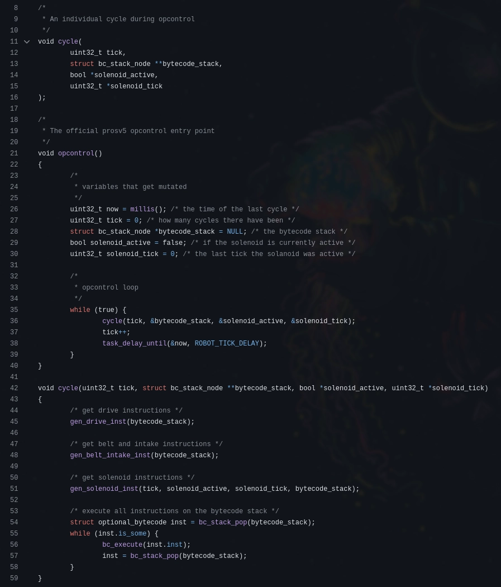
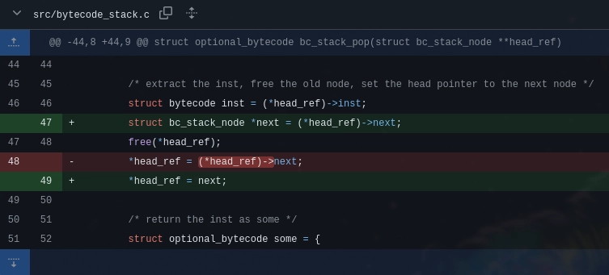

> ***note:** the time gap between this entry and the last entry is due to the school holidays where we didn't have physical access to the robot*

# Tuesday, 1st of October 2024
---
- **Aim:** To experiment with 6-motor chain-drive on the robot
- ## Wheels
  - To acommodate for the chain drive which had previously not fit due to the width of the green *(normal)* omni-drive wheels; we replaced them with some newer, smaller and more importantly slimmer anti-static *(grey)* omni-drive wheels
  - This had already been started in the previous robotics session, though completed in this one
  - 
- ## Chain Drive
  - Alongside the replacement of the wheels, the first iteration of the 6-motor chain-drive was also implemented
  - It chained together all three motors on each side with gears of varying diameters
  - For some reason, that would later be fixed, the chain drive would cause the robot to **drive really slowly**
  - 
- ## Mogo *(Mobile Goal)* Grabber
  - Previously, the mogo-grabber was secured in place with zipties an would fall out rather frequently
  - So, to solve this, the mogo-grabber was cut to shape and then actually screwed and secured to the pneumatics piston
    - 
  - 
  - Securing the mogo grabber in place with a screw actually ended up breaking and reducing the effectiveness of the mogo grabber; this would be addressed in future robotics sessions
- ## Program C Rewrite
  - While Hudson was working on the *physical* robot, Ethan got bored and re-implemented most of the robot code in `c` to both learn the language and also test robot features that aren't yet supported by the rust `vex-rt` *(by proxy the `safe-vex` library too as it depends on `vex-rt`)* library such as file-system io
  - This will suffice for testing experimental file-system or redering features until Ethan fully rewrites the rust `safe-vex` library to not depend on `vex-rt` and use raw *(but safe)* `FFI` bindings to the `Purdue PROS C` library
  - 
- ## C Program Memory Issue
  - The c-rewrite of the robot code crashed on startup as there was a `segfault` due to a read after free memory bug in the hand-rolled linked-list implementation in the program
  - This was swiftly fixed by Ethan after some trouble-shooting
  - 
