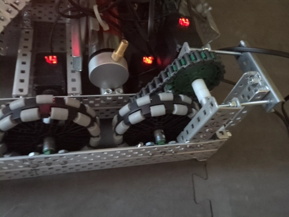
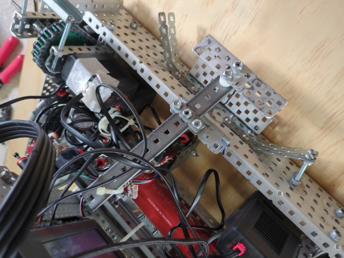
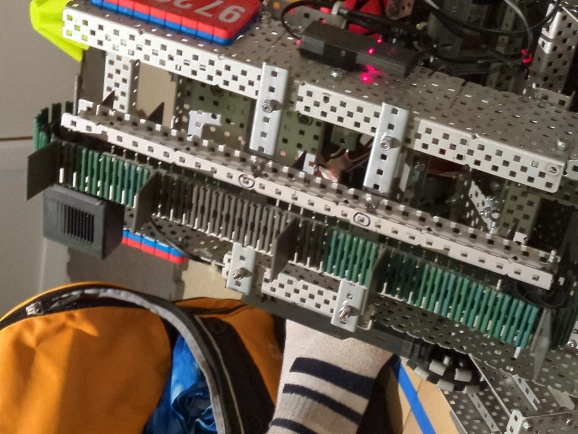

# Thursday, 3rd of October 2024
---
- **Aim:** To fix the chain drive issues, the mogo-grabber and the conveyor-belt
- ## Fixing Chain Drive Issues
  - As mentioned previously, there were a few issues with the chain-drive setup:
    - The robot would limp when moving and sort of jump whenever it accelerated or deccelerated
    - The robot was extremely slow compared to before we added chains
    - The chain was hard to tighten
  - We initially thought the first two issues with the chain-drive were caused by the friction of the chain rubbing against the robot
  - Though, after a few tests, we found the actual reason to be that the gear ratio was off, as, for the three motors, we used different sized gears to connect to the chain which would cause issues
    - *This issue was solved by using gears of the same diameter*
  - We also found that it would just be easier to chain the additional 6th motors to the front two motors instead of all of the motors and that it would achieve about the same effect
  - 
  - *A chain tightener/tensioner was also added to make tightening the chain a piece of cake*
- ## Fixing Mogo-Grabber Issues
  - As mentioned previously, the mogo-grabber stopped working altogether after it was screwed in place to the pneumatics piston
  - This is due to the screw not having the same degree of freedom in it's movement than a zip-tie which limits how much the robot can clamp; removing the utility of the mogo-grabber
  - This issue was solved by simply reverting back to the old mogo-grabber design that utilised zip-ties to hold them place
  - Though the previous issue of the piston occationally slipping out of the mogo-grabber, was solved by adding yet more zip-ties to secure the zip-ties
  - 
    - *ignore the tape, we were low on cables and the only one we had, had a broken clip so we had to secure it in place*
- ## Fixing the Conveyor Belt
  - There was an issue with the conveyor-belt where, at some point when it was shooting the rings onto the goals/stakes, it has a little unreliable skip that would cause the ring to either land perfectly, fly over it or bounce right off
  - We solved this issue through relinking the conveyor-belt belt and by evening out the flaps so that it's a smoother movement of the ring
  - 
  - We also fine-tuned the conveyor-belt speed so that the ring would land perfectly on the goal/stake about `9/10` times
- So far, we've solved all the issues with the robot and we can now finally let Charlie practice and hone his driving skills
