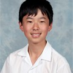
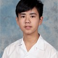

# Team Members
---
- **Hudson:** Team Captain & Main Builder
- **Aaron:** Main Builder
- **Charlie:** Main Driver
- **Ethan:** Main Programmer
- **Jake:** Head of Screwing
- **Daniel:** Chief of Innovations
- **Issac:** Main Strategyzer

## Hudson
---
**Roles:** Team Captain & Main Builder

## Aaron
---
**Roles:** Main Builder & Strategist

## Charlie
---
**Roles:** Driver & Strategist

## Jake
---
**Roles:** Backup Driver & Builder

## Ethan
---
**Roles:** Sole Programmer & maintainer of the `safe-vex` library

## Daniel
---
**Roles:** Strategist & Main Logbooker

## Issac
---
**Roles:** Builder & Design Tester

